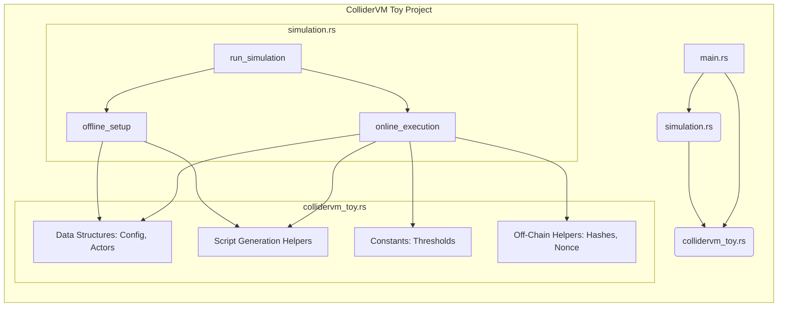
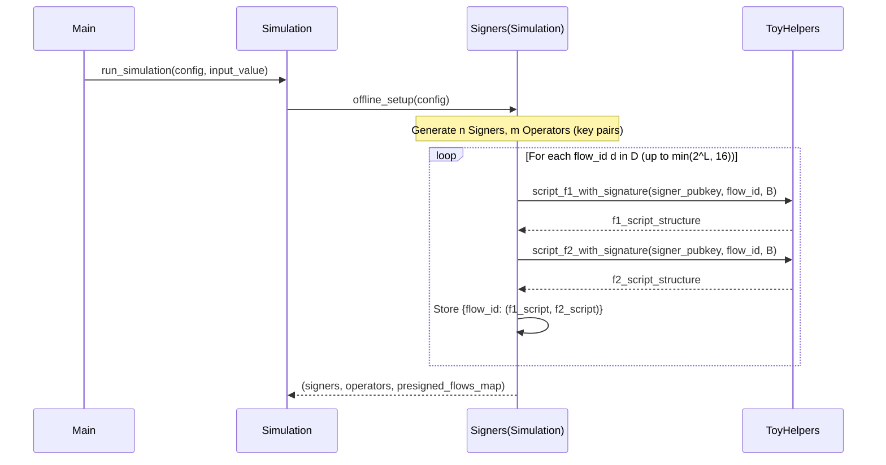
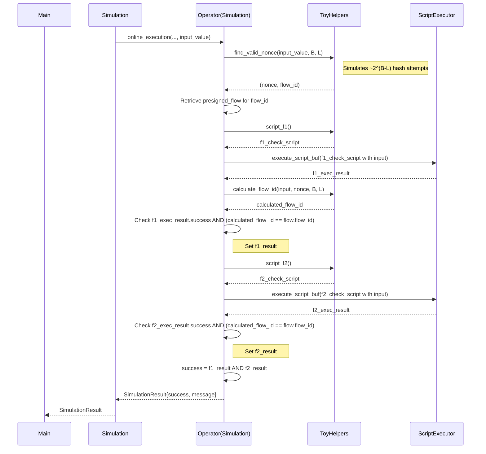

# ColliderVM Toy Simulation

This project provides a simplified Rust simulation of the concepts presented in the [ColliderVM: Stateful Computation on Bitcoin](https://eprint.iacr.org/2025/591) paper. It aims to demonstrate the core mechanisms of ColliderVM, particularly the use of presigned transaction flows and hash collision challenges for enabling stateful computation on Bitcoin without relying on fraud proofs.

**Disclaimer:** This is a _toy_ simulation and does **not** implement a production ready implementation of the ColliderVM protocol. It simplifies many aspects for clarity and focus on the protocol's structure.

## Background: ColliderVM Core Concepts

The ColliderVM paper proposes a method to achieve stateful computation on Bitcoin, addressing limitations of the Bitcoin script language. Key concepts include:

- **Stateful Computation:** Enabling computations that persist across multiple transactions, comprising:
  - **Data Persistence:** Accessing/modifying data across transactions.
  - **Logic Persistence:** Enforcing a specific sequence of computational steps.
- **Actors:**
  - **Signers (n):** Responsible for the offline setup, creating and signing transaction templates. Assumes 1-out-of-n are honest for safety.
  - **Operators (m):** Responsible for online execution, providing inputs, finding nonces, and broadcasting transactions. Assumes 1-out-of-m are honest for liveness.
- **Presigned Flows:** Signers create multiple (`2^L`) parallel transaction sequences (flows) offline. Each flow corresponds to a unique identifier (`d`) from a predefined set `D`.
- **Hash Collision Challenge:** To ensure input consistency across steps in a flow, the Operator must find an input `x` and a nonce `r` such that the first `B` bits of a hash `H(x, r)` match a specific flow identifier `d` within the set `D` (`H(x, r)|_B = d ∈ D`).
- **Computational Gap:** Finding a _single_ valid pair `(x, r)` for _any_ `d ∈ D` requires `~2^(B-L)` hash computations (honest work). Finding _two different pairs_ `(x, r) ≠ (x', r')` that map to the _same_ `d` (cheating) requires significantly more work (`~2^(B-L/2)` for double collision, `~2^(B-L/3)` for triple collision).
- **Capital Efficiency:** By avoiding fraud proofs, ColliderVM aims to eliminate the capital lock-up period required in systems like BitVM2.

## ColliderVM Toy: MVP Design Choices

This simulation implements a minimal viable product (MVP) to showcase the core ColliderVM flow (specifically the "Double Collision Variant" described in the paper):

- **Simplified Functions:** Instead of a complex computation like STARK verification, we use two simple subfunctions:
  - `F1(x)`: Checks if `input_value > 100`.
  - `F2(x)`: Checks if `input_value < 200`.
    The overall function `F(x)` succeeds only if `F1(x) AND F2(x)` is true.
- **Simulated Actors:** We generate `n` signers and `m` operators with `secp256k1` key pairs, representing the actors holding keys.
- **Simulated Presigning:** We don't create actual Bitcoin transactions. Instead, we generate the _locking scripts_ that _would_ be part of the presigned transactions. These scripts include placeholders for signature checks and the hash prefix check.
- **Simplified Hash Check:** The `script_check_hash_prefix` function and the script generation (`script_f1_with_signature`, `script_f2_with_signature`) simulate the check `H(x,r)|_B = d` by directly embedding and comparing the `flow_id` (`d`) rather than implementing the hash function (`H`) and bit extraction in Bitcoin Script.
- **Simulated Signature Check:** The scripts include `OP_CHECKSIGVERIFY` and the signer's public key, but the actual execution (`execute_script_buf` from `bitvm`) doesn't perform cryptographic signature verification in this toy setup. We simulate the _structure_ of the script.
- **Limited Flows:** We generate `min(2^L, 16)` flows for demonstration purposes, rather than the potentially huge `2^L` required in a real deployment.
- **Off-Chain Hash Calculation:** The Operator's task of finding a valid nonce `r` (`find_valid_nonce`) and the flow ID calculation (`calculate_flow_id`) are done using Rust's `blake3` library, simulating the off-chain work.
- **Script Execution:** We use `bitvm::execute_script_buf` to simulate the execution of the simplified `F1` and `F2` check scripts (without the signature/hash checks) to determine if the input satisfies the function constraints.

## Architecture

The project consists of three main parts:

- **`main.rs`**: Parses command-line arguments, sets up the `ColliderVmConfig`, orchestrates the simulation (`simulation::run_simulation`), and prints the final results.
- **`collidervm_toy.rs`**: Defines the core data structures (`ColliderVmConfig`, `SignerInfo`, `OperatorInfo`), constants (`F1_THRESHOLD`, `F2_THRESHOLD`), helper functions for off-chain calculations (`calculate_blake3_hash`, `calculate_flow_id`, `find_valid_nonce`), and functions to generate the _structure_ of the Bitcoin scripts (`script_f1`, `script_f2`, `script_f1_with_signature`, `script_f2_with_signature`).
- **`simulation.rs`**: Implements the two main phases of the ColliderVM simulation:
  - `offline_setup`: Simulates Signer actions (key generation, creating `PresignedFlow` script structures).
  - `online_execution`: Simulates Operator actions (finding nonce, selecting flow, executing checks).



## Simulation Flow

The simulation proceeds in two phases, mimicking the ColliderVM protocol:

### Offline Setup Phase (`offline_setup` in `simulation.rs`)

This phase simulates the actions performed by the Signers before any specific input `x` is known.

- **Generate Actors:** Create `n` Signers and `m` Operators, each with a `secp256k1` key pair (`SignerInfo`, `OperatorInfo`).
- **Generate Presigned Flow Scripts:** For each potential flow ID `d` in the set `D` (up to `min(2^L, 16)` in this simulation):
  - Generate the script for `F1` including the simulated signature and hash prefix check (`script_f1_with_signature`), using Signer 0's public key and the current `flow_id`.
  - Generate the script for `F2` similarly (`script_f2_with_signature`).
  - Store these script structures in a `HashMap` keyed by `flow_id`, representing the set of presigned flows available to the Operator.



### Online Execution Phase (`online_execution` in `simulation.rs`)

This phase simulates the actions performed by an Operator once an input `x` (`input_value`) is known.

- **Select Operator:** Choose Operator 0 for the simulation.
- **Find Nonce & Flow ID:**
  - Call `find_valid_nonce(input_value, B, L)` which iteratively calculates `calculate_flow_id(input_value, nonce, B, L)` (simulating `H(x, r)|_B = d`) until a `nonce` (`r`) is found that produces a `flow_id` (`d`) within the allowed range `[0, 2^L - 1]`. This simulates the Operator's hash collision search work (`~2^(B-L)` effort).
- **Select Presigned Flow:** Retrieve the corresponding `PresignedFlow` struct (containing the script structures for `F1` and `F2`) from the `HashMap` using the calculated `flow_id`.
- **Simulate F1 Execution:**
  - Construct a simple script containing only the `F1` logic (`input_value > F1_THRESHOLD`).
  - Execute this script using `execute_script_buf`.
  - Check if the execution was successful _and_ if the `flow_id` calculated in step 2 matches the one associated with the retrieved flow (simulating the `H(x,r)|_B = d` check within the script).
  - Record `f1_result`.
- **Simulate F2 Execution:**
  - Perform a similar process for `F2` (`input_value < F2_THRESHOLD`).
  - Execute the F2-only script.
  - Check script success and `flow_id` consistency.
  - Record `f2_result`.
- **Determine Overall Success:** The simulation succeeds if and only if `f1_result` AND `f2_result` are both true.
- **Return Result:** Package the success status and a descriptive message into `SimulationResult`.



## How to Run

- **Prerequisites:** Ensure you have Rust and Cargo installed ([https://www.rust-lang.org/tools/install](https://www.rust-lang.org/tools/install)).
- **Build:** Navigate to the project directory and build the project:
  
  ```bash
  cargo build
  ```

- **Run with Default Input (114):**

  ```bash
  cargo run
  ```

  This input (114) satisfies both `F1 (114 > 100)` and `F2 (114 < 200)`, so the simulation should succeed.

- **Run with Custom Input:** Provide an integer as a command-line argument:

  ```bash
  cargo run <input_value>
  ```

  - Example (Fails F1): `cargo run 90`
  - Example (Fails F2): `cargo run 250`

## TODO list to complete the Toy implementation

- Generating actual, signable Bitcoin transaction templates.
- Having Signers produce real `secp256k1` signatures for the presigned flows.
- Integrating with a Bitcoin library to construct, sign, and potentially broadcast transactions.
- Handling the complexities of UTXO management and transaction chaining.
- Managing the potentially massive storage requirements for `2^L` flows.

This toy simulation provides a foundational understanding of the protocol's structure and flow before tackling these significant implementation challenges.

## References

- [ColliderVM: Stateful Computation on Bitcoin](https://eprint.iacr.org/2025/591)
