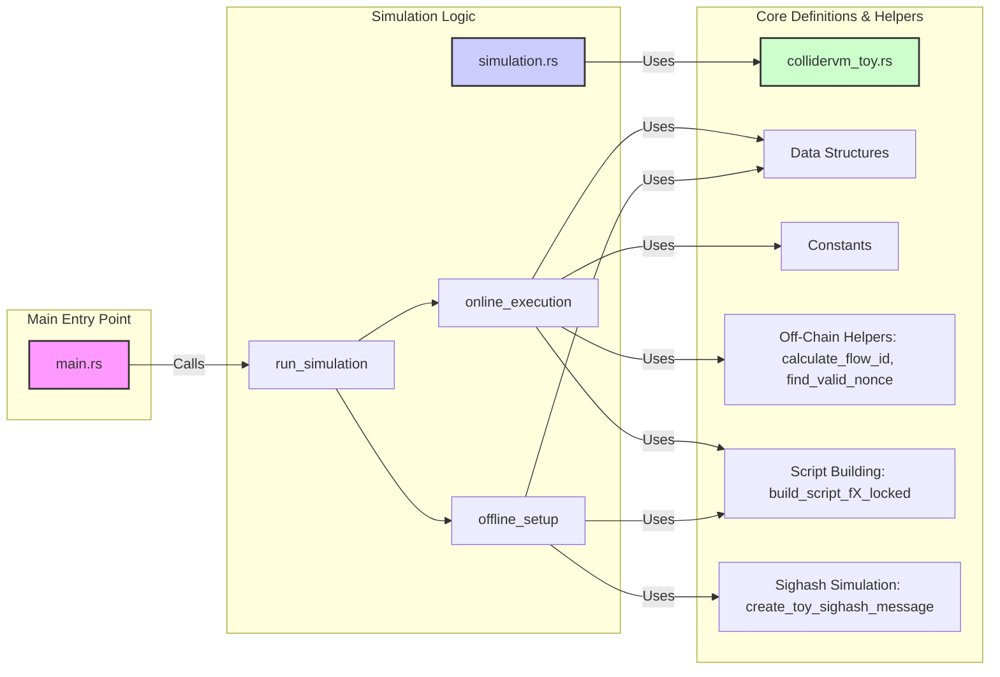

# ColliderVM Toy Simulation

This project provides a simplified Rust simulation of the concepts presented in the [ColliderVM: Stateful Computation on Bitcoin](https://eprint.iacr.org/2025/591) paper. It demonstrates the core mechanisms of ColliderVM, particularly the use of presigned transaction flows and hash collision challenges for enabling stateful computation on Bitcoin without relying on fraud proofs.

**Disclaimer:** This is a _toy_ simulation and does **not** implement a production-ready ColliderVM protocol. It simplifies many aspects (like signature verification, sighashing, and transaction structure) for clarity and focuses on the protocol's structural flow and the hash collision mechanism.

## Background: ColliderVM Core Concepts

The ColliderVM paper proposes a method to achieve stateful computation on Bitcoin, addressing limitations of the Bitcoin script language. Key concepts include:

- **Stateful Computation:** Enabling computations (data & logic) to persist across multiple Bitcoin transactions.
- **Actors:**
  - **Signers (n):** Offline setup participants who create and sign transaction templates (flows). Assume 1-of-n are honest for safety (preventing invalid state transitions).
  - **Operators (m):** Online execution participants who provide inputs, find nonces via hashing, and broadcast transactions. Assume 1-of-m are honest for liveness (ensuring the process can proceed).
- **Presigned Flows (`D`):** A set of `2^L` pre-agreed, parallel transaction sequences. Each flow corresponds to a unique identifier `d` from the set `D`.
- **Hash Collision Challenge:** To ensure the _same_ input `x` is used across steps in a chosen flow `d`, the Operator must find a nonce `r` such that the first `B` bits of a hash `H(x, r)` match that specific flow identifier `d` (i.e., `H(x, r)|_B = d ∈ D`).
- **Computational Gap:**
  - **Honest Work:** Finding _any_ valid pair `(x, r)` such that `H(x, r)|_B ∈ D` takes `~2^(B-L)` hash computations.
  - **Malicious Work (Double Collision):** Finding _two different pairs_ `(x, r) ≠ (x', r')` that map to the _same_ flow `d` (i.e., `H(x, r)|_B = H(x', r')|_B = d`) takes significantly more work (`~2^(B-L/2)`), making it computationally expensive to cheat by using different inputs within the same flow.
- **Capital Efficiency:** A key goal is to avoid the capital lock-up periods associated with fraud-proof-based systems like BitVM2.

## ColliderVM Toy: Design Choices & Simplifications

This simulation implements a minimal proof-of-concept:

- **Simple Function (`F`):** Instead of complex logic (like STARK verification), the computation `F(x)` is split into two subfunctions:
  - `F1(x)`: Checks if `input_value > 100`.
  - `F2(x)`: Checks if `input_value < 200`.
  - The overall computation succeeds only if `F1(x) AND F2(x)` is true for the _same_ input `x` within the chosen flow.
- **Simulated Actors:** Generates `n` Signers and `m` Operators with `secp256k1` key pairs (`SignerInfo`, `OperatorInfo`), but their roles in complex multi-party signing or liveness are simplified.
- **Simulated Presigning:** Creates placeholder Bitcoin `Transaction` structures (`create_placeholder_tx`) and calculates simplified sighash messages (`create_toy_sighash_message`). It collects real Schnorr signatures but doesn't handle actual UTXO management or realistic fee calculation.
- **Simplified Bitcoin Script:**
  - **Hash Check:** The script check `H(x, r)|_B = d` is _simulated_ by directly pushing the expected `flow_id` (`d`) onto the stack and using `OP_EQUALVERIFY` against the `flow_id` provided in the witness. It does _not_ implement the hash function `H` or bit extraction within Bitcoin Script.
  - **Signature Check:** Scripts include `OP_CHECKSIGVERIFY` and the Signer's public key. However, the `bitvm::execute_script_buf` function used for simulation does _not_ perform cryptographic signature verification. It checks script logic but assumes signatures are valid if provided.
- **Limited Flows:** Generates `min(2^L, 16)` flows instead of the full `2^L` for performance reasons in this demo.
- **Off-Chain Hashing:** The Operator's nonce search (`find_valid_nonce`) uses Rust's `blake3` library to simulate the `~2^(B-L)` off-chain work.

## Project Structure

The codebase is organized into three main Rust modules:

- **`src/main.rs`**:
  - The executable entry point.
  - Parses command-line arguments (for the input value `x`).
  - Sets up the `ColliderVmConfig` (n, m, L, B, k).
  - Calls `simulation::run_simulation` to orchestrate the entire process.
  - Prints the final simulation results.
- **`src/collidervm_toy.rs`**:
  - Defines the core data structures (`ColliderVmConfig`, `SignerInfo`, `OperatorInfo`, `PresignedStep`, `PresignedFlow`).
  - Contains constants (e.g., `F1_THRESHOLD`).
  - Implements helper functions primarily used _off-chain_ or for setup:
    - `create_toy_sighash_message`: Simulates sighash generation.
    - `calculate_flow_id`: Computes `H(x, r)|_B` using Blake3.
    - `find_valid_nonce`: Simulates the Operator's hash search.
  - Implements functions to _build_ the Bitcoin locking scripts (`build_script_f1_locked`, `build_script_f2_locked`) incorporating the simplified logic, hash, and signature checks.
- **`src/simulation.rs`**:
  - Implements the two main phases of the ColliderVM simulation protocol:
    - `offline_setup`: Simulates the Signers generating keys and creating/signing all the `PresignedFlow`s for all potential flow IDs `d`.
    - `online_execution`: Simulates the Operator finding a nonce for a given input `x`, selecting the corresponding flow `d`, constructing the full witness and script, and executing the F1 and F2 scripts.
  - Uses helper functions and data structures from `collidervm_toy.rs`.
  - Uses `bitvm::execute_script_buf` to simulate the execution of the constructed Bitcoin scripts.



## Simulation End-to-End Flow

The `cargo run [input_value]` command triggers the following sequence:

1. **Initialization (`main.rs`)**: Parses the optional `input_value` (or defaults to 114) and sets up the `ColliderVmConfig` (n=3, m=2, L=4, B=8, k=2).

2. **Offline Setup Phase (`simulation::offline_setup`)**: Simulates actions performed by Signers _before_ the input `x` is known.

    - Generates keypairs for 3 Signers and 2 Operators.
    - Loops `2^L = 16` times (for `flow_id` 0 to 15).
    - **Inside the loop (for each `flow_id` `d`)**:
      - **F1 Setup**:
        - Builds the F1 locking script (`build_script_f1_locked`) containing checks for `x > 100`, `flow_id == d`, and a Signer signature.
        - Creates a placeholder F1 transaction (`create_placeholder_tx`) spending a dummy input.
        - Calculates a toy sighash for F1 (`create_toy_sighash_message`).
        - All 3 Signers sign this sighash, producing signatures.
        - Stores the F1 template, sighash, signatures, and script in a `PresignedStep`.
      - **F2 Setup**:
        - Builds the F2 locking script (`build_script_f2_locked`) containing checks for `x < 200`, `flow_id == d`, and a Signer signature.
        - Creates a placeholder F2 transaction spending the _output_ of the F1 placeholder transaction.
        - Calculates a toy sighash for F2.
        - All 3 Signers sign this sighash.
        - Stores the F2 template, sighash, signatures, and script in a second `PresignedStep`.
      - Adds the `PresignedFlow` (containing the F1 and F2 steps) to a `HashMap` keyed by the `flow_id` (`d`).
    - Returns the generated Signer/Operator info and the `presigned_flows_map`.

3. **Online Execution Phase (`simulation::online_execution`)**: Simulates actions performed by an Operator _after_ the input `x` (`input_value`) is known.

    - **Nonce Search**: Calls `find_valid_nonce(input_value, B, L)`.
      - This function starts with `nonce = 0`.
      - It repeatedly calculates `d = calculate_flow_id(input_value, nonce, B, L)` (which computes `Blake3(input_value || nonce)|_B`).
      - If `d < 2^L` (i.e., `d` is in the set `D` = {0..15}), it returns the successful `(nonce, d)`. This simulates the `~2^(B-L)` = `~2^(8-4)` = `~16` expected hashes.
      - If not, it increments the nonce and tries again.
    - **Flow Selection**: Retrieves the `PresignedFlow` for the `flow_id` (`d`) returned by `find_valid_nonce` from the `presigned_flows_map`.
    - **(Optional) Off-Chain Checks**: Verifies the Signer 0 signature for F1/F2 and the hash calculation `H(x,r)|_B = d` using Rust crypto functions (for logging/debugging).
    - **F1 Script Execution**:
      - Constructs the witness script: `script_builder.push(sig_f1).push(flow_id).push(input_value)`.
      - Concatenates the witness script bytes with the F1 locking script bytes (`step_f1.locking_script`).
      - Calls `bitvm::execute_script_buf` on the combined script.
      - Stores the success/failure result (`script_f1_success`).
    - **F2 Script Execution**:
      - Constructs the witness script: `script_builder.push(sig_f2).push(flow_id).push(input_value)`.
      - Concatenates the witness script bytes with the F2 locking script bytes (`step_f2.locking_script`).
      - Calls `bitvm::execute_script_buf` on the combined script.
      - Stores the success/failure result (`script_f2_success`).
    - **Result Calculation**: Determines overall `success` as `script_f1_success && script_f2_success`.
    - Returns a `SimulationResult` containing the success status and results of individual script executions.

4. **Output (`main.rs`)**: Prints a summary message indicating whether the simulation succeeded or failed, based on the returned `SimulationResult`.

## How to Run

- **Prerequisites:** Ensure you have Rust and Cargo installed ([https://www.rust-lang.org/tools/install](https://www.rust-lang.org/tools/install)).
- **Build:** Navigate to the project directory and build the project:

  ```bash
  cargo build
  ```

- **Run with Default Input (114):**

  ```bash
  cargo run
  ```

  This input (114) satisfies both `F1 (114 > 100)` and `F2 (114 < 200)`, so the simulation should succeed (assuming a valid nonce is found).

- **Run with Custom Input:** Provide an integer as a command-line argument:

  ```bash
  cargo run <input_value>
  ```

  - Example (Fails F1 logic check): `cargo run 90`
  - Example (Fails F2 logic check): `cargo run 250`

## Future Enhancements

To create a more complete implementation, potential improvements include:

- Generate actual, signable Bitcoin transaction templates using `bitcoin` library features.
- Produce real secp256k1 signatures for the presigned flows.
- Integrate with Bitcoin libraries for transaction construction and potentially broadcasting.
- Handle UTXO management and transaction chaining realistically.
- Implement efficient storage for the potentially large number of flows (`2^L`).
- Implement the actual hash function `H` and bit extraction `|_B` within Bitcoin script.
- Implement the double/triple collision resistant variants from the paper (Section 2.2).

## References

- [ColliderVM: Stateful Computation on Bitcoin](https://eprint.iacr.org/2025/591)
