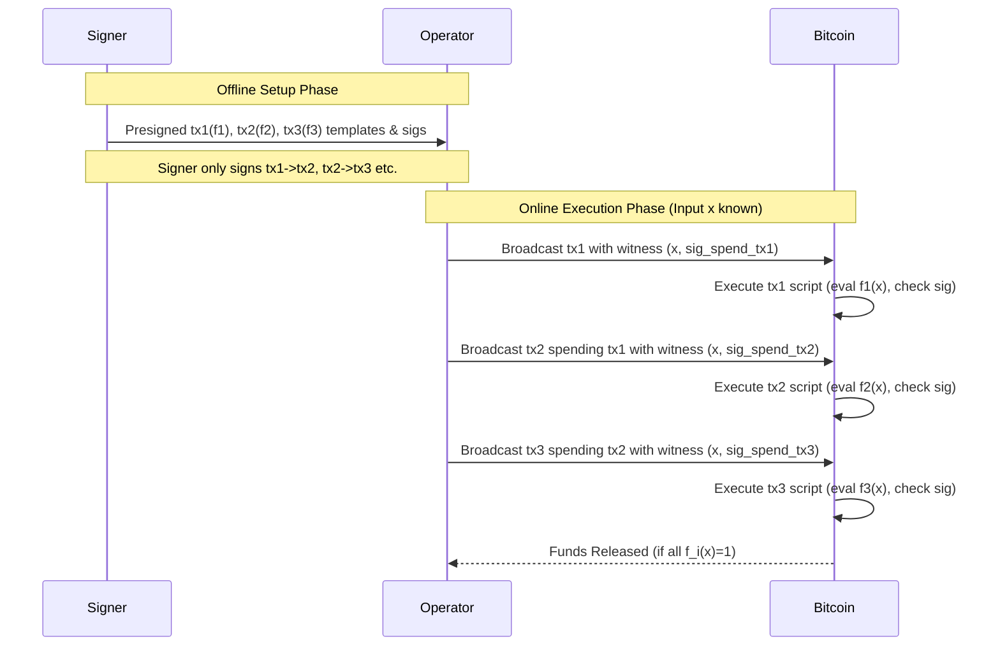
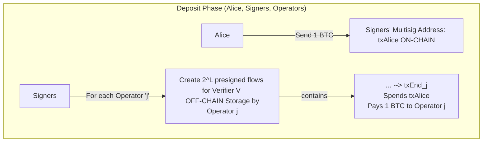

# Detailed Explanation of ColliderVM

## Introduction: The Challenge of Stateful Computation on Bitcoin

Bitcoin's scripting language (Bitcoin Script) is intentionally limited. It's stack-based, lacks loops, and has restrictions on script size, opcode count, and stack depth. A significant limitation highlighted by the paper is the difficulty in performing **stateful computation**. This refers to computation that needs to persist across multiple transactions and user interactions. It comprises two key components:

- **Data Persistence:** The ability for a program (script) to access or modify data stored on-chain from previous executions or leave data for future executions _accessibly within the script itself_.
- **Logic Persistence:** The ability to ensure that a specific sequence of computational logic (defined across multiple scripts/transactions) is followed, preventing users from arbitrarily changing the program flow when spending outputs.

Without native support for statefulness (like proposed opcodes such as `OP_CAT`), implementing complex applications like multi-step smart contracts, certain vault designs, or trust-minimized L2 bridges directly on Bitcoin is challenging.

## Existing Approaches and Motivation for ColliderVM

The paper briefly reviews existing methods for approximating stateful computation:

- **Multisig:** Relies on a trusted set of `n` entities, requiring `t` to be honest (tradeoff between safety and liveness). Considered a baseline "non-solution" due to weaker trust assumptions.
- **Covenants:** Requires Bitcoin protocol upgrades (e.g., `OP_CAT`, `OP_CTV`). Would allow scripts to constrain future spending transactions, enabling true data and logic persistence with Bitcoin's security assumptions. Currently unavailable.
- **ColliderScript:** Emulates covenants using computationally intensive hash collision finding. No extra trust assumptions but complex.
- **Functional Encryption (FE):** Theoretical approaches using advanced cryptography. Concrete, verifiable constructions are not yet established. May require trusted setup.
- **BitVM (specifically BitVM2):** Uses a fraud-proof system with `n` signers and `m` operators. Requires 1-of-n signer honesty (for safety) and 1-of-m operator honesty (for liveness). Allows onlookers to challenge and slash fraudulent computations.
  - _Key Drawback:_ Relies on fraud proofs, leading to **capital inefficiency**. Operators pay users out-of-pocket for withdrawals and must wait for a challenge period before reimbursement, creating liquidity demands.

**ColliderVM aims to provide stateful computation with BitVM-like 1-of-n honesty assumptions but _without_ relying on fraud proofs, thereby addressing the capital inefficiency problem.**

## The Core ColliderVM Mechanism (Double Collision Variant)

ColliderVM combines presigned transactions for logic persistence with a hash collision-based commitment scheme for data persistence.

### Logic Persistence via Presigned Transactions

Consider a function `f(x)` too large for one transaction, split into `f(x) = f1(x) ∧ f2(x) ∧ f3(x)`.

- **Setup (Offline):** A "Signer" creates three transaction templates (`tx1`, `tx2`, `tx3`).
  - `tx1`'s script contains logic for `f1(x)` and checks for the Signer's signature on the spending transaction (`tx2`).
  - `tx2`'s script specifies `tx1`'s txid as an input, contains logic for `f2(x)`, and checks for the Signer's signature on the spending transaction (`tx3`).
  - `tx3`'s script specifies `tx2`'s txid as an input, contains logic for `f3(x)`, and checks for the Signer's signature.
- The Signer _presigns_ the spending authorization for `tx1` -> `tx2`, `tx2` -> `tx3`, etc., and gives these templates/signatures to an "Operator". Crucially, the Signer _only_ signs these specific transitions.
- **Execution (Online):** The Operator, knowing `x`, provides it as input (witness) to each transaction in sequence.
  - `tx1` executes `f1(x)`.
  - `tx2` spends `tx1` (using the presigned authorization), executes `f2(x)`.
  - `tx3` spends `tx2`, executes `f3(x)`.
  - The final output is released (e.g., rewarding the Operator).

This enforces the _logic_ `f1 -> f2 -> f3`.



### The Inconsistent Input Problem

The scheme above is insecure. Bitcoin signatures (pre-Taproot) don't cover witness data. A malicious Operator could provide _different_ inputs `x1`, `x2`, `x3` to each transaction, such that `f1(x1)=1`, `f2(x2)=1`, `f3(x3)=1`, even if no single `x` exists where `f(x)=1`.

### Data Persistence via Hash Collision Puzzle

ColliderVM introduces a hash-based commitment to enforce input consistency.

- **Setup:**
  - Choose parameters `L` and `B` (integers, `B > L`).
  - Define a public set `D` of `2^L` specific bitstrings (e.g., integers `0` to `2^L - 1`). Membership in `D` must be easily verifiable in Bitcoin Script.
  - Define a hash function `H`.
  - An input `x` and a nonce `r` form a **valid B-pair** for `d ∈ D` if the first `B` bits of `H(x, r)` equal `d`. Notation: `H(x, r)|_B = d`.
  - The Signer now creates **`2^L` parallel presigned transaction flows**. Each flow corresponds to a unique `d ∈ D`.
  - Flow `d`: Consists of `tx_{1,d}, tx_{2,d}, ..., tx_{k,d}` (where `f` is split into `k` parts).
  - The script for each `tx_{i,d}` is modified:
    - Checks the Signer's signature (as before).
    - **New Check:** Takes `x_i` and `r_i` from the witness, computes `H(x_i, r_i)`, and verifies that `H(x_i, r_i)|_B = d`. The value `d` is hardcoded into the script specific to this flow.
    - Executes the subfunction `f_i(x_i)`.

```mermaid
graph TD
    subgraph "ColliderVM Setup (Signer)"
        direction LR
        D_Set["Set D = {d1, d2, ..., d_2^L}"]
        subgraph "Flow for d1"
            direction LR
            tx_1_d1["tx_1,d1 <br> Check: Sig, H(x,r)|_B=d1, f1(x)"] --> tx_2_d1["tx_2,d1 <br> Check: Sig, H(x,r)|_B=d1, f2(x)"] --> ...
        end
         subgraph "Flow for d2"
            direction LR
            tx_1_d2["tx_1,d2 <br> Check: Sig, H(x,r)|_B=d2, f1(x)"] --> tx_2_d2["tx_2,d2 <br> Check: Sig, H(x,r)|_B=d2, f2(x)"] --> ...
        end
        D_Set --> Flow for d1
        D_Set --> Flow for d2
        D_Set --> Flow_for_d_2L[...]

        Signer -->|"Generate 2^L Flows"| D_Set
    end

    subgraph "ColliderVM Execution (Operator)"
        Operator --"Knows x"--> FindPair["Find (r, d) s.t. H(x,r)|_B = d"]
        FindPair --"Found pair for d_i"--> SelectFlow["Select Flow d_i"]
        SelectFlow --> ExecuteFlow["Execute tx_1,d_i ... tx_k,d_i <br> Witness: (x, r, sig)"]
        ExecuteFlow --> Result["Success if f(x)=1"]
    end
```

### Security Analysis & Computational Gap

- **Honest Operator:** Needs to find _one_ valid B-pair `(x, r)` for _any_ `d ∈ D`.
  - The probability of a random `H(x, r)` landing in `D` (given `H` is random-like) is `|D| / 2^B = 2^L / 2^B = 1 / 2^(B-L)`.
  - Expected work (hash evaluations): `2^(B-L)`.
- **Malicious Operator (Cheating):** Wants to use different inputs `(x, r)` and `(x', r')` within the _same_ flow `d`. This requires finding `x, r, x', r'` such that `(x, r) != (x', r')` AND `H(x, r)|_B = H(x', r')|_B = d`. This is equivalent to finding a collision within the space of hash prefixes that map to `d`.
  - Finding such a collision relies on the birthday paradox.
  - Expected work (hash evaluations): Approximately `sqrt(2^B / 2^L) = sqrt(2^(B-L))` _if_ we could target any `d`. But we need a collision for a _specific_ `d` the operator is forced into by the first transaction. The paper simplifies this analysis (perhaps implicitly assuming the attacker can influence the choice of `d` or averaging over all `d`) and states the attacker needs `~2^(B-L/2)` work.
  - The factor `2^(L/2)` comes from the birthday attack on the `2^L` possible target values within `D`. The `2^(B-L)` factor remains because finding _any_ item mapping to `D` still takes that much work on average.

**Proposition 1 Summary:** For `f` split into `k` subfunctions, ColliderVM requires `2^L` flows. Honest work is `B-L` bits. Malicious work (double collision) is `B-L/2` bits.

- **Example Parameters:** `L=46`, `B=120`.
  - `2^46` presigned flows (requires significant storage).
  - Honest work: `120 - 46 = 74` bits (`2^74` hashes).
  - Malicious work: `120 - 46/2 = 120 - 23 = 97` bits (`2^97` hashes).

## The Triple Collision Variant

To increase the security gap (attacker's work) at the cost of on-chain resources.

- **Assumption:** Any _pair_ of subfunctions `(f_i, f_j)` fits into a single Bitcoin transaction.
- **Mechanism:** Instead of `k` transactions computing `f_i`, create `q = k choose 2` transactions. Each transaction `tx_{ij, d}` in flow `d` computes _both_ `f_i(x)` and `f_j(x)`, and checks the hash `H(x, r)|_B = d` and the Signer's signature.
- **Security:** To cheat, an attacker must provide inputs such that no single input `x` satisfies all `f_1...f_k`. The paper argues this requires finding _three_ distinct valid B-pairs `(x, r)`, `(x', r')`, `(x'', r'')` that collide on the _same_ `d` (i.e., `H(x,r)|_B = H(x',r')|_B = H(x'',r'')|_B = d`).
  - Expected malicious work: `~2^(B - L/3)` bits.
- **Tradeoff:**
  - Requires `k choose 2` transactions per flow instead of `k`.
  - Each transaction computes two subfunctions instead of one.
  - Total script opcode overhead factor is `(k choose 2) * 2 / k = k-1`.

**Proposition 2 Summary:** Requires `2^L` flows of `k choose 2` transactions each. Honest work is `B-L` bits. Malicious work (triple collision) is `B-L/3` bits.

- **Example Parameters:** `L=39`, `B=110`.
  - `2^39` flows (less storage than the double collision example).
  - Honest work: `110 - 39 = 71` bits.
  - Malicious work: `110 - 39/3 = 110 - 13 = 97` bits. (Same security with less storage, but higher on-chain cost).

**Proposition 3:** This `k choose 2` structure is minimal if limited to two subfunctions per transaction and assuming subfunctions are "independent" enough (satisfying any `k-1` doesn't imply satisfying all `k`).

## Security Model Summary

- **Assumptions:**
  - 1-out-of-n Signers are honest (Safety: prevents signing invalid flows).
  - 1-out-of-m Operators are honest (Liveness: ensures valid computations can be executed).
  - Finding hash collisions for `H` is computationally hard (specifically, finding `(x,r) != (x',r')` with `H(x,r)|_B = H(x',r')|_B` for the _same_ `d` is harder than finding a single valid B-pair).
- **No Onlookers/Fraud Proofs:** Security relies on the upfront setup by signers and the computational puzzle for the operator, not on external watchers challenging invalid states.

## Extensions

The protocol can be extended to multiple signers and operators:

### Multiple Signers (`m`)

Require all `m` signers to sign each presigned transaction. Script checks for all `m` signatures (e.g., using `OP_CHECKMULTISIG` or sequential checks). Safety requires only 1 honest signer to withhold signature from invalid flows.

### Multiple Operators (`n`)

Signers generate the `2^L` flows _for each_ of the `n` operators (potentially using operator-specific keys if needed, though the paper doesn't detail this interaction). Liveness requires only 1 honest operator to eventually find a B-pair and execute a valid flow.

## Applications

### Onchain Computation Delegation (STARK Verification)

- Problem: Verifying complex computations (like STARK proofs) on Bitcoin is expensive due to script limitations (opcodes, stack size, script size). Verifiers often exceed single transaction limits.
- ColliderVM Solution: Split the STARK verifier `V` into subfunctions `V_1, ..., V_k`. Use ColliderVM to execute the verification across `k` transactions, ensuring the same proof `π` (or relevant parts) is checked consistently.
  - The input `x` becomes the proof `π` (or a commitment to it).
  - The operator (prover) finds `(π, r)` such that `H(π, r)|_B = d` and executes the corresponding flow `d`.
- Comparison to BitVM2 for STARKs:
  - BitVM2 uses pairing-based SNARKs (smaller proofs but huge verifiers, measured in gigabytes of script opcodes) and fraud proofs. Storage overhead per bit committed across transactions is ~26 bytes (Winternitz signatures).
  - ColliderVM uses STARKs (larger proofs but potentially much smaller verifiers, e.g., ~80M opcodes estimated for Circle STARKs using emulated BLAKE3, potentially ~10M with Bitcoin-friendly hashes). Storage overhead depends on `H(x, r)|_B` check; ~88 bytes/bit estimated using BLAKE3, potentially lower with better hashes or by only committing to _parts_ of the proof (`π`) across transactions (Section 4.3, Figure 5).

### L2 Bridges

- Goal: Allow users to deposit BTC to an L2 and withdraw it later, secured by Bitcoin L1.
- Parties: Users, L2 Sequencers, Bridge Operators (`n`), Signers (`m`).
- High-Level Flow (Alice deposits 1 BTC, transfers to Bob on L2, Bob withdraws 1 BTC):
  - **Deposit (Alice):**
    - Alice sends 1 BTC to an address controlled by the Signers (`txAlice`).
    - Signers (cooperating with Alice, possibly offline) create `n * 2^L` presigned flows for a verification program `V`.
    - Each flow `d` for operator `j` ends in a final transaction `txEnd` that pays 1 BTC _to operator `j`_ and _consumes `txAlice`_. This `txEnd` requires signatures from the Signers and operator `j`.
    - These flows are held off-chain by the operators. `txAlice` is broadcast.



- **L2 Processing:** Sequencers process Alice's L2 mint, Alice->Bob transfer, Bob's L2 burn. Proofs are generated. State commitments might be posted to L1 (following Alpen Labs/sovereign rollup ideas) to establish canonical L2 state using Bitcoin consensus.
- **Withdrawal (Bob requests, Operator facilitates):**
  - Operator pays Bob 1 BTC out-of-pocket (`txBob`, associated with `txAlice`).
  - Operator obtains/generates proof `π` that verifies:
  - `txBob` occurred (SPV proof).
  - L2 state transitions from Alice's deposit to Bob's burn are valid (STARK proof).
  - Bob burned 1 BTC on L2.
  - L2 state used is canonical (linking to L1 commitments).
  - Operator finds nonce `r` such that `H(π, r)|_B = d` for some `d`.
  - Operator executes the corresponding presigned flow `d` (created during Alice's deposit for this operator). The witness includes `(π, r)` and signatures.
  - The final `txEnd` consumes `txAlice` and transfers Alice's original 1 BTC to the Operator, reimbursing them *immediately\* (no fraud proof window).

- **Challenges Mentioned:** Ensuring L2 state canonicality (solved by posting L2 state roots to L1), constant denomination problem (deposits/withdrawals fixed to multiples of a certain value).

## Benefits of ColliderVM (vs. BitVM2)

- **Capital Efficiency:** Operators are reimbursed immediately upon successful withdrawal verification, eliminating the need to lock capital during a fraud proof window.
- **Simpler Flow:** No complex challenge-response protocol or timeout logic in the main execution path.
- **Cross-Transaction Storage:** Overhead depends on hash implementation (`H(x,r)|_B` check) and potentially optimized commitment strategies (Figure 5), might be competitive or better than BitVM2's fixed Winternitz overhead, especially with Bitcoin-friendly hashes.
- **No Public Presigned Txs:** Presigned transactions don't need to be public for onlookers.
- **Operator Non-Interaction (Setup):** Operators might not need to be online during the deposit/presigning phase if their long-term keys are known.

## Drawbacks of ColliderVM

- **Presigned Transaction Storage:** Requires storing `n * 2^L` flows per deposit, potentially massive storage requirements.
- **Off-chain Computation Cost:** Operators must perform `~2^(B-L)` hash computations per withdrawal.
- **On-chain Computation Cost:** _Always_ executes the full verifier `V = V1 + ... + Vk` (total cost `sum |Vi|`), unlike BitVM2 which only executes `max |Vi|` on-chain _in case of a challenge_.

## Feasibility & Parameters

- Heavily depends on efficient **Bitcoin-friendly hash functions** to reduce opcode costs for the `H(x,r)|_B` check and within STARKs.
- STARK verifier implementation/optimization is key. ~10M opcodes might be feasible if amortized.
- **Parameter Choice:**
  - Double Collision: `L=46, B=120` -> `2^46` flows, 74-bit honest work, 97-bit malicious work.
  - Triple Collision: `L=39, B=110` -> `2^39` flows, 71-bit honest work, 97-bit malicious work (but `k-1` script overhead).

## Conclusion & Future Work

ColliderVM presents a novel approach to stateful computation on Bitcoin using presigned transactions and hash puzzles, notably avoiding fraud proofs and their associated capital inefficiency. It enables applications like STARK verification and L2 bridges with a 1-of-n security model. While promising, it faces challenges in storage and computation costs. Key research areas include: finding/implementing Bitcoin-friendly hashes, optimizing STARK verifiers for Bitcoin Script, reducing presigned flow storage, and improving the computational gap. The paper also notes ColliderVM _could_ be adapted to include fraud proofs, potentially simplifying existing fraud-proof systems.
